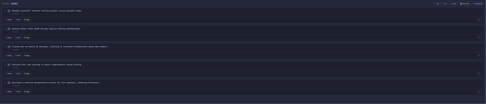
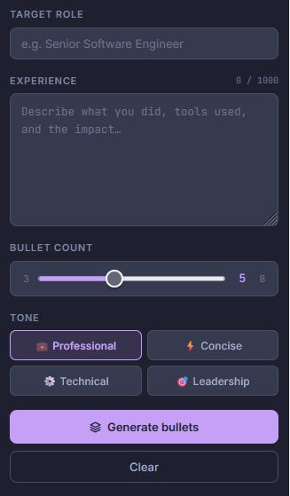
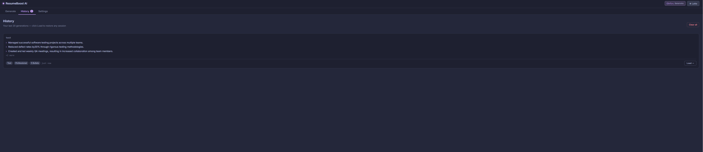
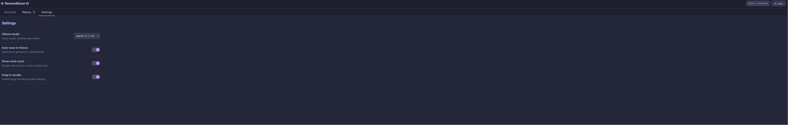

# 🚀 Resumio — Setup Guide

> **No programming experience required.**  
> Everything is **free** and runs **100% offline** on your machine.

---

## 📚 Wiki

Full documentation is available in the GitHub Wiki:

👉 [Project Wiki](../../wiki)

---

## 📋 Table of Contents

- [What You Need](#what-you-need)
- [Step 1 — Install Ollama](#step-1--install-ollama)
- [Step 2 — Install an AI Model](#step-2--install-an-ai-model)
- [Step 3 — Install Rust](#step-3--install-rust)
- [Step 4 — Open the Project](#step-4--open-the-project)
- [Step 5 — Build the Project](#step-5--build-the-project)
- [Step 6 — Run the Project](#step-6--run-the-project)
- [Step 7 — Open the App](#step-7--open-the-app)
- [Troubleshooting](#troubleshooting)
- [Quick Start (TL;DR)](#quick-start-tldr)
- [Website Showcase](#showcase)

---

## What You Need

| Tool | Purpose | Time to Install |
|------|---------|----------------|
| **Ollama** | Runs the AI locally on your machine | ~2 min |
| **Rust** | Runs the backend server | ~5 min |
| **This project** | The app code | Already done ✅ |

---

## Step 1 — Install Ollama

Ollama is the engine that runs AI models on your computer.

<details>
<summary>🍎 macOS / 🐧 Linux</summary>

Open **Terminal** and run:

```bash
curl -fsSL https://ollama.com/install.sh | sh
```

Verify it worked:

```bash
ollama --version
# Expected output: ollama version X.X.X
```

</details>

<details>
<summary>🪟 Windows</summary>

1. Download the installer → **<https://ollama.com/download>**
2. Run it and follow the prompts (Next → Next → Finish)
3. Open **PowerShell** and verify:

```powershell
ollama --version
# Expected output: ollama version X.X.X
```

</details>

---

## Step 2 — Install an AI Model

Pull the recommended model — it's small, fast, and works great:

```bash
ollama pull qwen2.5:1.5b
```

> ⏱️ This downloads ~1 GB. It only needs to happen once.

Confirm it's there:

```bash
ollama list
# You should see qwen2.5:1.5b in the list
```

---

## Step 3 — Install Rust

Rust compiles and runs the backend server.

<details>
<summary>🍎 macOS / 🐧 Linux</summary>

```bash
curl --proto '=https' --tlsv1.2 -sSf https://sh.rustup.rs | sh
```

When it finishes, **close and reopen your terminal**, then verify:

```bash
rustc --version
# Expected output: rustc X.XX.X (...)
```

</details>

<details>
<summary>🪟 Windows</summary>

1. Download the installer → **<https://www.rust-lang.org/tools/install>**
2. Run it and follow the prompts
3. **Close and reopen PowerShell**, then verify:

```powershell
rustc --version
# Expected output: rustc X.XX.X (...)
```

</details>

> 💡 **Must restart terminal after installing Rust** — this is the most common mistake.

---

## Step 4 — Open the Project

In your terminal, navigate to the project folder:

```bash
cd path/to/100_points_on_a_silver_plate
```

Not sure where it is? Common locations:

```bash
# macOS / Linux
cd ~/Downloads/100_points_on_a_silver_plate
cd ~/Desktop/100_points_on_a_silver_plate

# Windows
cd C:\Users\YourName\Downloads\100_points_on_a_silver_plate
```

---

## Step 5 — Build the Project

This downloads all dependencies and compiles the backend.  
**Only needed the first time** (or after updates):

```bash
cargo build
```

> ⏱️ First build can take 2–5 minutes. Subsequent builds are much faster.

---

## Step 6 — Run the Project

Start the server:

```bash
cargo run
```

You should see output like:

```
Listening on http://127.0.0.1:3000
```

> ✅ Keep this terminal window open while using the app.

---

## Step 7 — Open the App

Open your browser and visit:

```
http://127.0.0.1:3000
```

If you see the ResumeBoost AI interface — **you're done!** 🎉

---

## Troubleshooting

### ❌ `ollama: command not found`

| Check | Fix |
|-------|-----|
| Terminal not restarted | Close and reopen terminal |
| Install failed | Re-run the install command |
| Windows PATH issue | Restart your computer |

---

### ❌ No AI response / blank output

Ollama probably isn't running. Start it manually:

```bash
ollama serve
```

Then try again in the browser.

---

### ❌ `Model not found` error

Check what's installed:

```bash
ollama list
```

If `qwen2.5:1.5b` isn't listed, pull it again:

```bash
ollama pull qwen2.5:1.5b
```

---

### ❌ `rustc: command not found`

You need to restart your terminal after installing Rust. If that doesn't fix it, reinstall Rust.

---

### 🧩 The Golden Rule

> If something's broken, it's almost always one of these three:
> 1. **Ollama isn't running** → run `ollama serve`
> 2. **Model isn't installed** → run `ollama pull qwen2.5:1.5b`
> 3. **Terminal wasn't restarted** → close and reopen it

---

## Quick Start (TL;DR)

Already installed everything? Just run these three commands:

```bash
# 1. Start the AI engine
ollama serve

# 2. (New terminal tab) Start the app
cargo run

# 3. Open in browser
# http://127.0.0.1:3000
```

> 💡 **Tip:** Open two terminal tabs — one for `ollama serve`, one for `cargo run`.

---

## 🟢 You're All Set

Resumio is running fully locally.  
No internet connection needed. No data leaves your machine.

---

*Having issues not covered here? Check that all three steps above are complete before anything else.*

---

## Showcase











